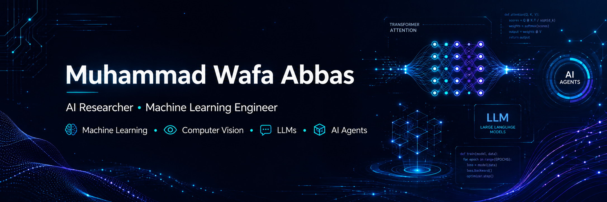

  

  

  

  

  

  

<h1 align="center">Hi 👋, I'm Muhammad Wafa Abbas</h1>

<h3 align="center">
AI Researcher • Machine Learning Engineer • Computer Science Student
</h3>

---

## 🚀 About Me

I'm **Muhammad Wafa Abbas**, a Computer Science undergraduate passionate about building intelligent systems that solve real-world problems.

My primary interests include **Machine Learning, Deep Learning, Computer Vision, Large Language Models (LLMs), AI Agents, Explainable AI (XAI), and Full-Stack AI Applications**.

I enjoy transforming research ideas into practical software—from medical image classification and deepfake detection to AI-powered analytics platforms and autonomous AI agents.

Currently, I'm focused on advancing my research, contributing to open source, and building impactful AI products.

---
## 🧠 Research Philosophy

I believe artificial intelligence should not only achieve high performance but also provide transparency, reliability, and real-world impact. My goal is to bridge cutting-edge research with practical applications by developing intelligent systems that are accurate, explainable, and accessible.

## 📑 Table of Contents

- [🚀 About Me](#-about-me)
- [💡 Quick Snapshot](#-quick-snapshot)
- [🎯 Currently Working On](#-currently-working-on)
- [🏆 Featured Projects](#-featured-projects)
- [💻 Tech Stack](#-tech-stack)
- [📊 GitHub Statistics](#-github-statistics)
- [📜 Certifications](#-certifications)
- [🔬 Research Interests](#-research-interests)
- [📫 Let's Connect](#-lets-connect)

## 💡 Quick Snapshot

- 🎓 Computer Science Undergraduate at UET Lahore
- 🤖 AI Researcher & Machine Learning Engineer
- 🔬 Interested in LLMs, AI Agents, Computer Vision & XAI
- 🧠 Building research-driven AI applications
- 🌱 Continuously learning and exploring new AI technologies
- 💬 Ask me about Python, TensorFlow, Scikit-Learn, FastAPI, Next.js, or AI
- 📫 Reach me at **wafaabbas044@gmail.com**
  
## 🔬 Research Interests

- 🤖 Machine Learning
- 🧠 Deep Learning
- 👁️ Computer Vision
- 💬 Large Language Models (LLMs)
- 🕸️ AI Agents & Multi-Agent Systems
- 🔍 Explainable AI (XAI)
- 📊 AutoML
- ⚙️ MLOps

---

## 🎯 Currently Working On

- 🧠 Explainable Brain Tumor MRI Classification
- 🎭 Deepfake Face Detection using Ensemble Learning
- 🤖 AgentLytic AI – AI-Powered Analytics & AutoML Platform
- 🧩 AI Agents powered by LLMs
- 📚 Research, experimentation, and open-source AI projects

---
## ⚡ Fun Fact

I enjoy turning complex AI research into practical, user-friendly applications that anyone can use.

## 💻 Tech Stack

### 👨‍💻 Programming Languages

---

### 🤖 AI & Machine Learning

**Libraries & Frameworks**

`Scikit-learn` • `Keras` • `XGBoost` • `NumPy` • `Pandas` • `Matplotlib` • `SHAP` • `Grad-CAM` • `CBAM`

---

### 🚀 Backend & Web Development

---

### 🗄️ Databases

---

### ☁️ Tools & Platforms

---

### 🧠 Currently Learning

- Large Language Models (LLMs)
- AI Agents
- Retrieval-Augmented Generation (RAG)
- LangChain
- Multi-Agent Systems

---

## 📊 GitHub Statistics

  
  

  
  

---

## 📈 Contribution Graph

  

## 🏆 Featured Projects

### 🧠 Brain Tumor MRI Classification
**Explainable Multi-Backbone Feature Fusion Framework with CBAM Attention and XGBoost Stacking**

- 🧩 Multi-Backbone Feature Fusion (EfficientNetB0, ResNet50, DenseNet121)
- 🎯 CBAM Attention + XGBoost Stacking
- 📈 93.56% Accuracy • 98.76% ROC-AUC
- 🔍 Explainable AI using SHAP & Grad-CAM
- 📖 Research project under active development

> 🔒 **The Kaggle notebook is currently private and will be published soon.**  
> 📌 **Kaggle Profile:** 

---

### 🤖 AgentLytic AI
**AI-Powered Analytics & AutoML Platform**

- 📊 Automated EDA & Data Preprocessing
- 🤖 AutoML Model Training & Evaluation
- 💬 AI Agent Chat
- ⚡ FastAPI • Next.js • PostgreSQL
- 🧠 Explainable AI (XAI)

> 🔒 **Source code is private while the platform is under active development.**

---

### 🎭 Deepfake Face Image Detection
**Stacked Ensemble Learning with Explainable AI**

- 🧠 EfficientNetB0 • ResNet50 • DenseNet121
- ⚡ XGBoost Stacking Ensemble
- 📈 94.00% Accuracy • 0.982 ROC-AUC
- 🔍 Explainability using SHAP & Grad-CAM

> 🔒 **The Kaggle notebook is currently private and will be published soon.**  
> 📌 **Kaggle Profile:** 
---

## 📜 Certifications

- 🏅 IBM Machine Learning Professional Certificate
- 🏅 Machine Learning Specialization (University of Washington)
- 🏅 Neural Networks and Deep Learning
- 🏅 Foundations of Model Optimization and Deep Learning

> 📚 Continuously expanding my knowledge in Artificial Intelligence, Machine Learning, Deep Learning, LLMs, and AI Agents.

## 💭 Favorite Quote

⭐ If you find my work interesting, consider following my journey and connecting with me.

## 📫 Let's Connect

